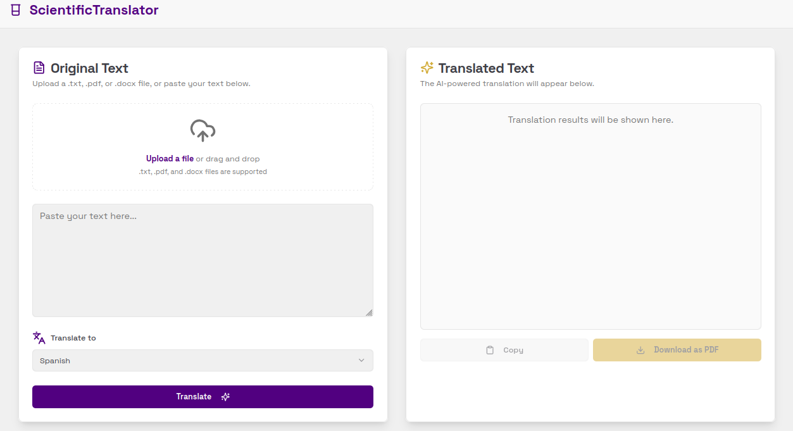

# ScientificTranslator

ScientificTranslator is a modern web application designed to help researchers, students, and professionals translate scientific texts with high accuracy while preserving document structure. 
Powered by GigaChat, it provides seamless translation into multiple languages, ensuring that complex information is accessible across linguistic barriers.



## Core Features

-   **AI-Powered Translation**: Leverages advanced AI models to translate scientific texts, maintaining context and technical accuracy.
-   **Multiple Language Support**: Select from a wide range of target languages for your translation needs.
-   **File Upload**: Easily upload your documents in text format. The UI is prepared for future support of PDF, DOCX, and other formats.
-   **Side-by-Side View**: Compare the original text and the translated output in a clean, intuitive interface.
-   **PDF Export**: Download the translated document as a PDF file with a single click.
-   **Responsive Design**: A clean, accessible, and responsive interface that works on all devices.

## Getting Started

Follow these instructions to get a copy of the project up and running on your local machine for development and testing purposes.

### Prerequisites

-   Node.js (v18 or later)
-   npm, yarn, or pnpm

### Installation

1.  **Clone the repository:**
    ```bash
    git clone https://github.com/bazhil/ScientificTranslator.git
    cd ScientificTranslator
    ```

2.  **Install dependencies:**
    ```bash
    npm install
    ```

3.  **Set up environment variables:**
    An empty `.env` file has been created for you. Add your Google API key to it:
    ```
    GIGA_CHAT_MODEL=GigaChat-2-Max
    GIGA_CHAT_BASE_URL=https://gigachat.devices.sberbank.ru/api/v1
    GIGA_CHAT_TOKEN_URL=https://ngw.devices.sberbank.ru:9443/api/v2/oauth
    GIGA_CHAT_AUTH_KEY=
    GAGA_CHAT_CLIENT_ID=
    GIGA_CHAT_SCOPE=GIGACHAT_API_PERS
    NODE_TLS_REJECT_UNAUTHORIZED=0
    ```

4.  **Run the development server:**
    ```bash
    npm run dev
    ```
    Open [http://localhost:9002](http://localhost:9002) with your browser to see the result.

## Deployment

This application is configured for easy deployment using Docker.

### Docker

1.  **Build the Docker:**
    ```bash
    docker compose up --build
    ```

2.  **Run the Docker container:**
    ```bash
    docker compose down
    ```
The application will be available at `http://localhost:9002`.

## License

This project is licensed under the MIT License - see the [LICENSE](LICENSE) file for details.
